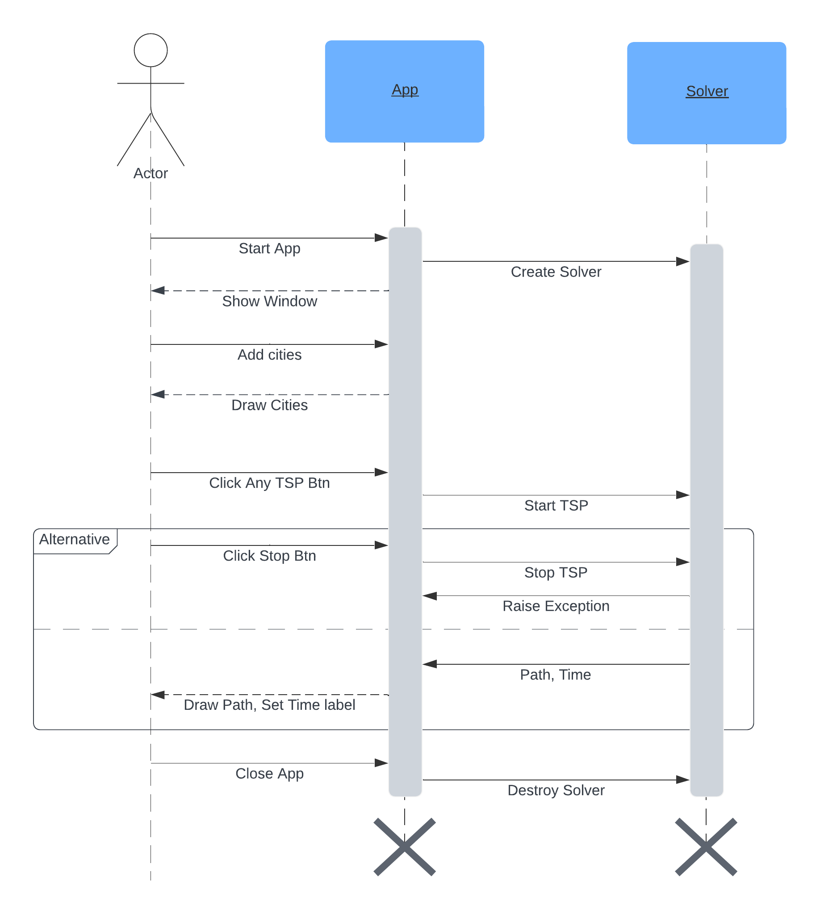

# Travelling Salesman Problem

The Traveling Salesman Problem (TSP) is one of the most famous combinatorial optimization problems. In the TSP, the goal is to find the shortest possible route that visits each city exactly once and returns to the original city. It's a classic problem in the field of operations research, computer science, and mathematics, with applications in logistics, transportation, manufacturing, and more. The TSP can be approached using various algorithms, each with its own strengths and weaknesses. We impelemented three different method and compare them to each others.  

### Neirest Neighboor (NN)

The Nearest Neighbor algorithm is a simple heuristic method used to approximate solutions to the TSP. The basic idea is to start from any city and repeatedly choose the nearest unvisited city until all cities have been visited, forming a tour. The algorithm does not guarantee an optimal solution but provides a relatively good solution quickly, especially for large problem instances.

### Brute Force (BF)

The Brute Force method is a straightforward approach to solve the TSP by considering all possible permutations of the cities and selecting the one with the shortest total distance. While this method guarantees an optimal solution, it becomes impractical for large numbers of cities due to its exponential time complexity.

### Genetic Algorithm (GA)

Genetic Algorithms (GAs) are population-based optimization techniques inspired by the process of natural selection and evolution. They are particularly useful for solving complex optimization problems like the TSP.

## Diagrams

### Class Diagram

<p align="center">
   
</p>

### Sequence Diagram

<p align="center">
    
</p>

## Dependencies

Before running the program, ensure you have the following modules installed:

 - python (v3.8)
 - typing_extensions (v4.7.1)
 - numpy (v1.24.3)
 - Pillow (v10.0.1)

We recommend using conda for setup:

```shell script
conda create -n <env_name> python=3.8
```
```shell script
conda install anaconda::typing_extensions
```
```shell script
conda install anaconda::numpy
```
```shell script
conda install anaconda::pillow
```

## Testing

The test_*.py scripts contain unit tests for different classes. Additionally, you can run test_all.py to execute all unit tests simultaneously.

## Console App

The console application activates a random number of cities and runs each method to compare their time and solution quality. This demo can be found in the app_console.py file.

## GUI App

The GUI mode allows users to select cities from a list and run a TSP algorithm. The GUI displays the selected cities and the calculated path. Underneath the graph, an estimated remaining runtime is shown, and users can stop the calculation anytime using the stop button.

<p align="center">
    
</p>

## Results

Below are some results demonstrating the performance of each method:

|Method|Result|Num of Cities|time|
|:---:|:---:|:---:|:---:|
|Neirest Neighboor|Not always optimal| 5|00:00:00:00|
|Brute Force|Optimal| 5|00:00:00:00|
|Genetic Algorithm<br/>(p:100 g:100 m:0.01)|Almost Always Optimal| 5|00:00:00:56|
|Genetic Algorithm<br/>(p:500 g:100 m:0.05)|Almost Always Optimal| 5|00:00:02:97|
|Neirest Neighboor|Not always optimal|10|00:00:00:00|
|Brute Force|Optimal|10|00:01:31:61|
|Genetic Algorithm<br/>(p:100 g:100 m:0.01)|Usually Optimal|10|00:00:02:77|
|Genetic Algorithm<br/>(p:500 g:100 m:0.05)|Almost Always Optimal|10|00:00:13:41|
|Neirest Neighboor|Not always optimal|15|00:00:00:00|
|Brute Force|Optimal|15| ~ 3 years|
|Genetic Algorithm<br/>(p:100 g:100 m:0.01)|Usually Close to Optimal|15|00:00:09:82|
|Genetic Algorithm<br/>(p:500 g:100 m:0.05)|Usually Close to Optimal|15|00:01:07:29|
|Neirest Neighboor|Not always optimal|20|00:00:00:02|
|Brute Force|Optimal|20| ~ 7927448 years|
|Genetic Algorithm<br/>(p:100 g:100 m:0.01)|Almost Always Random path|20|00:00:24:23|
|Genetic Algorithm<br/>(p:500 g:100 m:0.05)|Usually Not Optimal|20|00:02:39:40|
